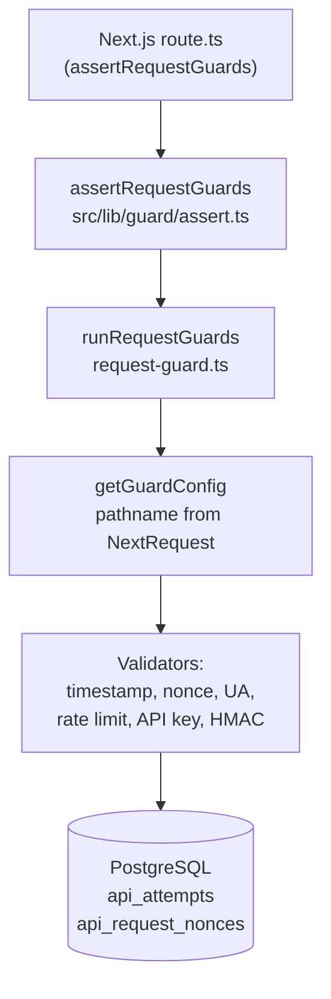

# Request guard system (Confinement)

This document explains how **API request guards** are wired in Confinement after the Peppercorn-aligned migration. It is the main handoff for engineers maintaining this repo. **UI route protection** (e.g. `AuthGuard` in layouts) is unrelated; only **`src/lib/guard`** and **`assertRequestGuards`** matter here.

For the full client/server contract (HMAC canonical string, headers, edge cases), keep using the Peppercorn reference: **`peppercorn/docs/guard-knowledge-transfer.md`** (sibling repo).

---

## How a request flows



1. Each **`/api/bc/**`** route handler starts with **`await assertRequestGuards(request)`** ([`src/lib/guard/assert.ts`](../src/lib/guard/assert.ts)). If it returns a `Response`, return it immediately (guard failure).
2. **`assertRequestGuards`** calls **`runRequestGuards`** ([`src/lib/guard/request-guard.ts`](../src/lib/guard/request-guard.ts)).
3. **`runRequestGuards`** resolves policy from **`getGuardConfig(request.nextUrl.pathname)`** ([`src/lib/guard/guard-manifest.ts`](../src/lib/guard/guard-manifest.ts)). **There is no hardcoded endpoint string** in the runner; pathname always comes from the request.
4. Validators run in order: **timestamp → nonce → user-agent (if enabled) → rate limit → API key → HMAC**. First failure returns a Peppercorn-style JSON body **`{ status, message, data: null }`** built inside [`request-guard.ts`](../src/lib/guard/request-guard.ts).
5. **Nonce** and **rate limit / attempt logs** use Prisma models **`ApiRequestNonce`** and **`ApiAttempt`** ([`prisma/schema.prisma`](../prisma/schema.prisma)).

---

## Prisma (same stack as Peppercorn)

| Piece | Location |
|--------|-----------|
| Versions | Same as Peppercorn: **`prisma`**, **`@prisma/client`**, **`@prisma/adapter-pg`** `^7.4.2` (lockfile may resolve a newer 7.x patch); **`pg`** `^8.16.x`. |
| Config | [`prisma.config.ts`](../prisma.config.ts) — `DATABASE_URL` and **`DATABASE_URL_UNPOOLED`** (required by Prisma CLI, same pattern as Peppercorn). |
| Schema | [`prisma/schema.prisma`](../prisma/schema.prisma) — `generator client` → **`src/lib/generated`**, `engineType = "binary"`. |
| Singleton + adapter | [`src/lib/prisma.ts`](../src/lib/prisma.ts) — `Pool` + `PrismaPg` adapter; lazy init so **`next build`** does not require a live DB at import time (first DB access still needs **`DATABASE_URL`** at runtime). |

Apply migrations locally / in CI when your database exists:

```bash
yarn db:migrate
# or: dotenv -e .env -- prisma migrate dev
```

Generate client (uses placeholder URLs from **`.env.example`** via `dotenv-cli`):

```bash
yarn db:generate
```

---

## Environment variables

| Variable | Required | Role |
|-----------|-----------|------|
| `DATABASE_URL` | Yes (runtime + migrate) | Postgres URL for the app / Prisma. |
| `DATABASE_URL_UNPOOLED` | Yes for Prisma CLI | Direct URL (e.g. non-pooler); local dev often equals `DATABASE_URL`. |
| `BC_EXTENSION_API_KEY` | Yes for S2S | Compared to header **`x-api-key`**. |
| `HMAC_SECRET_CURRENT` | Yes for S2S | HMAC-SHA256 over canonical string. |
| `HMAC_SECRET_PREVIOUS` | No | Rotation window. |
| `BC_REQUEST_MAX_AGE_MS` | No | Timestamp skew (default 30s). |
| `BC_REQUEST_CLOCK_SKEW_MS` | No | Future skew (default 10s). |
| `BC_NONCE_TTL_MS` | No | Nonce TTL (default 10m). |

See [`.env.example`](../.env.example).

---

## Manifest rules

- **Every** runtime path under `/api/bc/` that calls **`assertRequestGuards`** must have a matching entry in **`GUARD_MANIFEST`**.
- App Router folders use **`[orderNo]`**; the manifest uses **`:orderNo`** (e.g. `/api/bc/orders/:orderNo/details`). **`getGuardConfig`** maps runtime paths to these patterns.
- If a route calls guards but is **missing** from the manifest, clients get **500** — `"Guard configuration missing for /api/..."`.

---

## Cross-origin browser access (optional)

There is **no** Next.js `middleware.ts` in this repo for BC routes. **Guards do not depend on CORS.** Server-to-server callers are unchanged.

If a **browser on another origin** must call guarded `/api/bc/**` APIs with `x-api-key` / `x-signature` / etc., configure **`Access-Control-Allow-*`** at your **edge** (proxy, gateway, CDN) or in route handlers—same need Peppercorn solves in its own `middleware.ts`, but not duplicated here.

---

## App Router API layout (Peppercorn-aligned)

**Purpose:** Next.js **route groups**—folders named **`(public)`**, **`(s2s)`**, or top-level **`customer`**—do **not** appear in the URL. They exist so the codebase (and **`guard-audit.mjs`**) can tell **which trust model** a handler belongs to: who is allowed to call it and which auth helpers or guards must be present. That keeps “server-to-server with API key + HMAC” separate from “unauthenticated or browser-safe JSON” and from “logged-in customer APIs,” without changing public paths like **`/api/bc/...`**.

URLs are unchanged; only the **folder tree** under `src/app/api` uses those segments:

| Folder | Trust model / purpose |
|--------|------------------------|
| **`(s2s)/bc/**`** | **Server-to-server** integrations (e.g. Business Central extension). Callers prove identity with **`x-api-key`**, **`x-signature`**, nonce, timestamp, etc. Every `route.ts` must call **`assertRequestGuards`** or **`runRequestGuards`** and be listed in **`GUARD_MANIFEST`**. Runtime paths stay **`/api/bc/...`**. |
| **`(public)/`** | **No customer session and no admin token** on the route: open docs, health checks, or other endpoints that must not accidentally import **`requireCustomer`** / **`requireAdminApiToken`**. **Mutating** methods (POST/PUT/PATCH/DELETE) still need **`runRequestGuards`** / **`assertRequestGuards`** unless the audit script exempts the path (same idea as Peppercorn: rate limiting / abuse protection where it applies). |
| **`customer/`** | **End-user–authenticated** APIs (future **`/api/customer/...`**). Callers are identified as a **customer** (e.g. session), not as the BC extension. When you add routes here, each handler must call **`requireCustomer()`** plus **`runRequestGuards`** / **`assertRequestGuards`**, and register guarded paths in the manifest—**`guard-audit.mjs`** enforces that once `route.ts` files exist under this tree. |

---

## Governance

- **[`scripts/guard-audit.mjs`](../scripts/guard-audit.mjs)** — Same rules as Peppercorn’s audit, adapted for **`assertRequestGuards`**: **`customer`** → **`requireCustomer`** + guards; **`admin`** → **`requireAdminApiToken`**; **`(s2s)`** → guards; **`(public)`** mutating → guards unless exempt; any file that calls **`runRequestGuards`** / **`assertRequestGuards`** must be covered by **`GUARD_MANIFEST`**.
- Run: **`yarn test:guard-audit`**
- CI: [`.github/workflows/guard-audit.yml`](../.github/workflows/guard-audit.yml) (on push / PR).

---

## Checklist: new guarded BC route

1. Add **`route.ts`** under **`src/app/api/(s2s)/bc/...`** (URL remains **`/api/bc/...`**). Implement the handler with **`NextRequest`** and call **`assertRequestGuards(request)`** first.
2. Add the runtime path (or **`:param`** pattern) to **`GUARD_MANIFEST`** with the correct flags (`useTimestamp`, `useNonce`, `useHmac`, `useRateLimit`, `useApiKey`, `useUserAgent`, `rateLimitConfig`, …).
3. Update any **server-to-server callers** to send the required headers and HMAC per Peppercorn’s **`guard-knowledge-transfer.md`**.
4. Run **`yarn test:guard-audit`**.

---

## File map

| File | Role |
|------|------|
| `src/lib/guard/request-guard.ts` | Orchestrates validators; guard failure JSON + optional **`success()`** / **`ApiResponse`** (Peppercorn-shaped envelope). |
| `src/lib/guard/guard-manifest.ts` | Policy table + `getGuardConfig`. |
| `src/lib/guard/assert.ts` | Thin helper used from routes. |
| `src/lib/guard/auth-api-key.ts` | `x-api-key` vs `BC_EXTENSION_API_KEY`. |
| `src/lib/guard/hmac-validation.ts` | Body hash + canonical string + `x-signature`. |
| `src/lib/guard/timestamp-validation.ts` | `x-timestamp-ms`. |
| `src/lib/guard/nonce-validation.ts` | `x-nonce` + `api_request_nonces`. |
| `src/lib/guard/rate-limit.ts` | IP extraction, **`api_attempts`**, `logApiAttempt`. |
| `src/lib/guard/user-agent-validation.ts` | Optional automation UA filter (off for current BC manifest). |
---

## Guarded routes (current)

Static:

- `/api/bc/upload-image`
- `/api/bc/upload-pdf`
- `/api/bc/customers`
- `/api/bc/orders`
- `/api/bc/special-request-presets`

Dynamic (manifest patterns):

- `/api/bc/orders/:orderNo/details`
- `/api/bc/orders/:orderNo/lines`
- `/api/bc/orders/:orderNo/line-profiles`

---

## Peppercorn parity note

Confinement intentionally mirrors Peppercorn’s **Prisma 7 + adapter-pg + generated client path + `prisma.config.ts` env pattern** so fixes and upgrades can be compared across repos. Application code outside `/api/bc/**` is not part of this guard migration.
